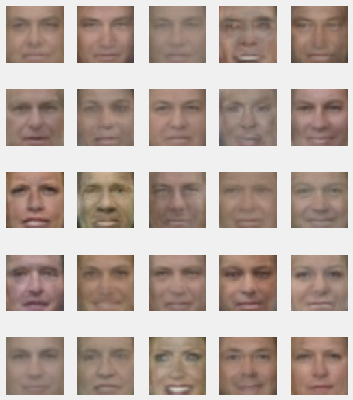
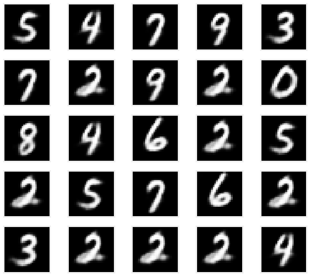

# Autoencoders
В данном ноутбуке содержится реализации разных автоэнкодеров, а именно:
 
**1. Vanilla Autoencoder**
 
**2. Variational Autoencoder**
 
**3. Conditional Variational Autoencoder**
 

Способы их применения рассматриваются на датасетах:
 
1. **Labelled Faces in the Wild (LFW)**. Этот датасет содержит картинки лиц людей и их атрибуты
 
2. **MNIST**. Этот датасет содержит картинки рукописных цифр от 0 до 9.

## Vanilla Autoencoder (AE)

	

Архитектура обычного автоэнкодера будет состоять из энкодера и декодера. Сами энкодер и декодер сформированы следующим образом:
 
**nn.Linear > nn.BatchNorm1d > nn.ReLU**
Картинки кодируются в латентные векторы энкодером, из которых потом декодер восстанавливает картинки. Для обучение используется обычная среднеквадратичная ошибка (MSE).

### AE Реконструкции

Автоэнкодер в большинстве случаев восстановил картинки достаточно близко к оригиналам, хотя в некоторых случаях заметны сильные искажения.

	

### AE Sampling
Автоэнкодер может генерировать новые картинки на основании векторов из нормального распределения размерности латентного пространства с небольшими корректировками.

Ниже картинки лиц, которые сгенерировал автоэнкодер. На них можно различить различные черты лиц, пола, эмоций.

	

### Добавление атрибутов на картинку

Автоэнкодер может не только восстанавливать картинки из латентных векторов, но и добавлять атрибуты (например, улыбки).

	

## Variational Autoencoder (VAE)

Отличие VAE от обычного AE заключается в так называемом **reparametrization trick**: преобразование, позволяющее перейти от случайной величины, имеющей стандартное нормальное распределение (со средним 0 и дисперсией 1), к произвольной нормальной случайной величине. Такой трюк позволяет генерировать латентный вектор из произвольного нормального распределения.
Для обучения VAE используется датасет с цифрами MNIST.

VAE состоит из энкодера и декодера.
 
Архитектура энкодера: **Conv2d > BatchNorm2d > ReLU**
 
Декодера: **ConvTranspose2d > BatchNorm2d > ReLU**

Лосс у VAE состоит из двух частей: **KL-divrgence** и **log-likelihood**.
### VAE Реконструкции

VAE хорошо восстанавливает картинки цифр на основании латентных векторов.

	

### VAE Sampling

Аналогично, как и с обычным AE, VAE моджно передать случайные векторы из нормального распределения и посмотреть, какие картинки получаются:

	

## Conditional VAE (CVAE)

Conditional VAE — так называется вид автоэнкодера, который позволяет генерировать картинки по заданному условию.

	

	

### CVAE Sampling

Восстановленные CVAE картинки разных классов из одного и того же вектора:

	

## Denoising

У автоэнкодеров, кроме сжатия и генерации картинок, есть другие практические применения. Автоэнкодеры могут быть использованы для избавления от шума на фотографиях (denoising). Для этого их нужно обучить специальным образом: входная картинка будет зашумленной, а выдавать автоэнкодер должен будет картинку без шума. 

	

## Image Retrieval

Также с помощью автоэкнодеров возможно искать похожие изображения. Например, лица. Для этого надо закодировать картинку в латентное представление и сравнить с латентными представлениями картинок в базе данных.

	

